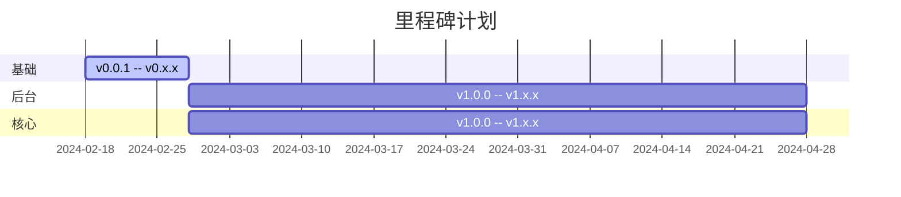
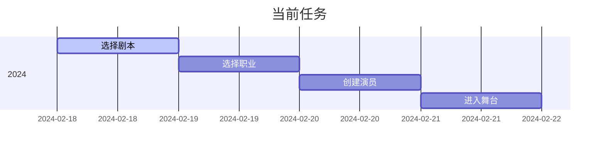
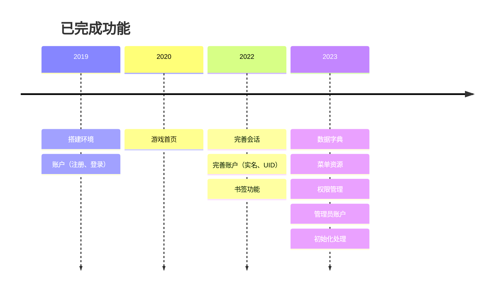

开发设计
=======

开发设计包括：主要功能、开发计划、开发环境、框架依赖、代码结构等内容。

---

## 主要功能

- 基础
    - [ ] 门户：背景图轮播
    - [ ] 账号：注册、登录
    - [ ] 剧本：不同的剧本属于不同的游戏内容——当然也可以是相同剧本由多个舞台演绎（即游戏多区）
- 后台
    - [ ] 初始化：数据、参数、账号
    - [ ] 管理后台（持续完善）
- 核心
    - [ ] 舞台：展示剧本包含的内容
    - [ ] 职业：一转（战士、魔法师、弓箭手），二转（未完待续）
    - [ ] 地图：世界地图、副本地图、活动地图等等
    - [ ] 剧情：周期主题、一次性主线和支线、日常循环
    - [ ] 玩家：创建游戏角色、选择职业、进入地图、开始剧情
    - [ ] 道具：除装备之外的各种消耗品或任务用品
    - [ ] 装备：装饰、服饰、武器、防具等等
    - [ ] 放置：解放双手、按期签到即可免费享用

## 开发计划

| 版本编号                 | 相关内容  | 时间节点        |
|----------------------|-------|-------------|
| `v0.0.1` -- `v0.x.x` | 基础    | 预计 2024 年完成 |
| `v1.0.0` -- `v1.x.x` | 后台&核心 | 预计 2024 年完成 |







## 开发环境

- `git version 2.27.0.windows.1`
- `java version "1.8.0_301"`
- `IntelliJ IDEA 2023.3.4 (Ultimate Edition)`
- `redis_version:6.0.16`
- `DBMS: MySQL (ver. 5.7.37-log)`
- `node.js v16.13.2`
- `npm 8.16.0`
- `@vue/cli 5.0.8`
- `WebStorm 2023.3.4`

## 框架依赖

通过 [行舟在线考试系统][1] 的实践，本项目决定直接转为 **前后端分离** 的架构。

后端基于`Spring Boot`框架，使用`Redis`和`MySQL`中间件，前端基于`vue-element-admin`模板进行二次开发。

后端依赖：

| 框架                                                                    | 备注                 |
|-----------------------------------------------------------------------|--------------------|
| [Spring Boot](https://spring.io/projects/spring-boot)                 | 基础框架               |
| [Spring Security](https://spring.io/projects/spring-security)         | 安全框架               |
| [Spring Data Redis](https://spring.io/projects/spring-data-redis)     | Redis 数据框架         |
| [Spring Data JPA](https://spring.io/projects/spring-data-jpa)         | JPA 框架             |
| [Spring Data REST](https://spring.io/projects/spring-data-rest)       | 基于 JPA 的 REST 框架   |
| [MySQL Connector Java](https://dev.mysql.com/doc/connector-j/8.0/en/) | MySQL 驱动           |
| [Spring Validation](https://beanvalidation.org/)                      | 参数校验               |
| [Lombok](https://projectlombok.org/)                                  | 便捷方法注解             |
| [UserAgentUtils](https://www.bitwalker.eu/software/user-agent-utils)  | 用户代理解析             |
| [Kaptcha](https://github.com/mrzhqiang/kaptcha-spring-boot-starter)   | 验证码                |
| [Helper](https://github.com/mrzhqiang/helper)                         | Java 常用的辅助工具       |
| [Geoip2](https://dev.maxmind.com/geoip?lang=en)                       | IP 转地理位置           |
| [RxJava](https://github.com/ReactiveX/RxJava)                         | 可观察序列的异步调用框架       |
| [OkHttp](https://github.com/square/okhttp)                            | 最好用的 HTTP Java 客户端 |
| [Retrofit](https://github.com/square/retrofit)                        | 声明式 RESTFUL 框架     |

以上仅列出最核心的后端依赖，如需了解全部内容，请访问项目中的`pom.xml`文件。

前端依赖：

```json
{
  "dependencies": {
    "axios": "0.18.1",
    "clipboard": "2.0.4",
    "codemirror": "5.45.0",
    "core-js": "^3.8.3",
    "driver.js": "0.9.5",
    "dropzone": "5.5.1",
    "echarts": "4.2.1",
    "element-ui": "2.13.2",
    "file-saver": "2.0.1",
    "fuse.js": "3.4.4",
    "js-cookie": "2.2.0",
    "jsencrypt": "^3.3.2",
    "jsonlint": "1.6.3",
    "jszip": "3.2.1",
    "normalize.css": "7.0.0",
    "nprogress": "0.2.0",
    "path-to-regexp": "2.4.0",
    "pinyin": "2.9.0",
    "screenfull": "4.2.0",
    "script-loader": "0.7.2",
    "sortablejs": "1.8.4",
    "tui-editor": "1.3.3",
    "vue": "^2.7.14",
    "vue-count-to": "1.0.13",
    "vue-i18n": "7.3.2",
    "vue-router": "3.0.2",
    "vue-splitpane": "1.0.4",
    "vuedraggable": "2.20.0",
    "vuex": "3.1.0",
    "xlsx": "0.14.1",
    "xregexp": "^5.1.1"
  }
}
```

前端依赖主要是`Vue`家族、`element-ui`框架以及一些常用的`js`工具和`css`样式。

## 代码结构

代码需要遵循一定的结构，好的代码结构阅读起来，一定是赏心悦目的。

在本项目中，后端遵循`Spring Boot`官方推荐的[代码结构规范][2]，即以功能为主，功能包内有控制器、服务、服务实现、仓库等内容。

```
├─docs                                  ——项目文档
├─├─deployment                             ——安装部署
├─├─develop                                ——开发设计
├─├─guide                                  ——使用指南
├─http                                  ——接口测试
├─src
├─├─main
├─├─├─java
├─├─├─├─com.github.mrzhqiang.hellgate
├─├─├─├─├─account                               ——账户
├─├─├─├─├─action                                ——操作
├─├─├─├─├─aop                                   ——切面
├─├─├─├─├─config                                ——配置
├─├─├─├─├─dict                                  ——字典
├─├─├─├─├─domain                                ——领域
├─├─├─├─├─exception                             ——异常
├─├─├─├─├─i18n                                  ——国际化
├─├─├─├─├─init                                  ——初始化
├─├─├─├─├─menu                                  ——菜单
├─├─├─├─├─role                                  ——角色
├─├─├─├─├─script                                ——剧本
├─├─├─├─├─session                               ——会话
├─├─├─├─├─stage                                 ——舞台
├─├─├─├─├─setting                               ——设置
├─├─├─├─├─third                                 ——第三方
├─├─├─├─├─user                                  ——用户
├─├─├─├─├─util                                  ——工具
├─├─├─├─├─HellgateApplication                   ——启动类
├─├─├─resources                             ——项目资源
├─├─test                                  ——单元测试
├─web                                   ——前端源码
```

在本项目中，前端保持`vue-element-admin`模板的代码结构，同时参考了`Vue`官方文档推荐的[代码结构规范][3]。

```
├─web                                   ——前端源码
├─├─build                                 ——构建目录
├─├─public                                ——公共目录，包含可访问的公共资源
├─├─├─favicon.ico                           ——网站图标
├─├─├─index.html                            ——入口页面
├─├─src                                   ——源代码目录
├─├─├─api                                   ——后端接口
├─├─├─assets                                ——资产
├─├─├─components                            ——组件
├─├─├─directive                             ——自定义指令
├─├─├─filters                               ——自定义过滤器
├─├─├─icons                                 ——图标
├─├─├─lang                                  ——国际化多语言
├─├─├─layout                                ——布局
├─├─├─router                                ——路由
├─├─├─store                                 ——全局存储
├─├─├─styles                                ——样式风格
├─├─├─utils                                 ——工具类
├─├─├─vendor                                ——供应商（第三方工具）
├─├─├─views                                 ——页面视图
├─├─├─├─base                                  ——基础
├─├─├─├─dashboard                             ——驾驶舱
├─├─├─├─login                                 ——登录
├─├─├─├─profile                               ——资料
├─├─├─├─system                                ——系统
├─├─├─App.vue                               ——单页面文件
├─├─├─main.js                               ——执行入口
├─├─├─permission.js                         ——权限相关
├─├─├─settings.js                           ——设置相关
├─├─tests                                 ——单元测试
├─├─package.json                          ——项目依赖
├─├─vue.config.js                         ——项目配置
```

[1]:https://github.com/mrzhqiang/rowing

[2]:https://docs.spring.io/spring-boot/docs/2.7.10/reference/html/using.html#using.structuring-your-code.locating-the-main-class

[3]:https://v2.cn.vuejs.org/v2/guide/instance.html#%E5%88%9B%E5%BB%BA%E4%B8%80%E4%B8%AA-Vue-%E5%AE%9E%E4%BE%8B
