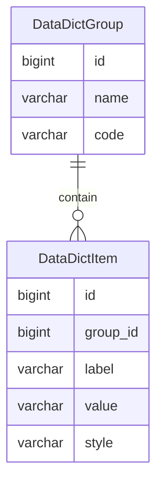

数据字典文档
=========

数据字典是固定参数，极少情况下会发生变化，因此可以等同于全局常量。

---

## 数据建模

由于 JPA 在设计一个实体包含多种定义时比较麻烦，即便使用复合主键得以实现，但要定义一对多、多对一关系却十分棘手，因此这里拆分出来数据字典分组和数据字典项。

### DataDictGroup

- name 数据字典分组名称，用于页面展示
- code 数据字典分组代码，用于代码检索

| name  | code            |
|-------|-----------------|
| 性别    | gender          |
| 格式化模板 | format_template |
| 序号模板  | serial_template |
| 布尔状态  | boolean_status  |
| 激活状态  | active_status   |
| 开关状态  | switch_status   |
| 启用状态  | enabled_status  |
| 事件状态  | event_status    |
| 任务状态  | task_status     |

### DataDictItem

- label 数据字典项标签，用于页面展示
- value 数据字典项数值，用于代码检索
- style 作为冗余字段，未来可能提供前端 css 样式

| group           | label    | value               |
|-----------------|----------|---------------------|
| gender          | 未知       | 0                   |
| gender          | 男        | 1                   |
| gender          | 女        | 2                   |
| format_template | 日期格式化    | yyyy-MM-dd          |
| format_template | 时间格式化    | HH:mm:ss            |
| format_template | 日期时间格式化  | yyyy-MM-dd HH:mm:ss |
| serial_template | 日期序号     | yyyyMMdd            |
| serial_template | 时间序号     | HHmmss              |
| serial_template | 日期时间序号   | yyyyMMddHHmmss      |
| serial_template | 日期时间毫秒序号 | yyyyMMddHHmmssSSS   |
| boolean_status  | 否        | 0                   |
| boolean_status  | 是        | 1                   |
| active_status   | 禁止       | 0                   |
| active_status   | 激活       | 1                   |
| switch_status   | 关闭       | 0                   |
| switch_status   | 开启       | 1                   |
| enabled_status  | 停用       | 0                   |
| enabled_status  | 启用       | 1                   |
| event_status    | 未执行      | 0                   |
| event_status    | 已完成      | 1                   |
| task_status     | 默认       | 0                   |
| task_status     | 预备       | 1                   |
| task_status     | 运行       | 2                   |
| task_status     | 成功       | 3                   |
| task_status     | 失败       | 4                   |
