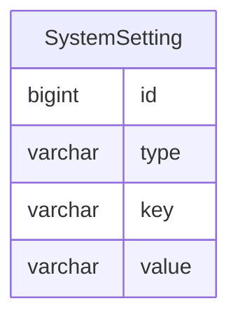

系统设置文档
=========

系统设置基于【约定优于配置】的理念，提供默认参数以保证开箱即用，后续也可以通过后台管理进行自定义配置。

---

## 数据建模

系统设置的数据结构与数据字典非常相似，但系统设置的更新频率比数据字典稍微高一点，因此需要单独建模。

### SystemSetting

- type 系统设置类型
- key 系统设置键
- value 系统设置值

| type | key   | value      |
|------|-------|------------|
| 基础设置 | title | 暗黑之门后台管理系统 |
