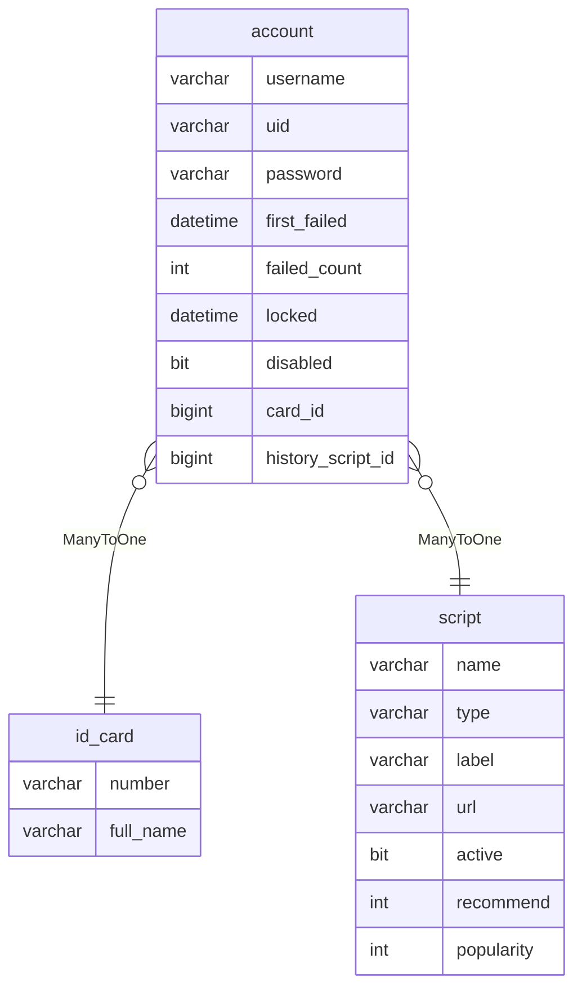

账号文档
======

参考地狱之门的账号设计，即一个账号可以通行所有游戏。

从开发角度来看，这实际上是类似单点登录的解决方案：
1. 用户首先登录账号中心，获得指定游戏的跳转链接
2. 随后携带账号认证信息访问此链接，此时该服务将自动调用认证接口
3. 认证成功则创建会话，认证失败则重定向到账号中心

目前有两种实现方案：
1. 共享 Redis 会话
   - 优点：会话管理方便
   - 缺点：需要维护 Redis 中间件
2. JWT 无状态认证
   - 优点：不需要额外的存储中间件
   - 缺点：基本告别会话管理

鉴于以上优缺点，最终选择共享 Redis 会话方案，同时将 GameSession 设计为 GameContext 以避免混淆概念。

---

## 数据建模

- username：用户名，创建时指定，唯一
- password：密码，创建时指定，加密存储
- uid：纯数字的唯一编号，创建时随机生成，可用于替代用户名进行登录
- first_failed：指定时间区间（管理后台设定）内的首次登录失败时间戳
- failed_count：指定时间区间（管理后台设定）内的失败次数统计
- locked：锁定时间戳，此时间戳如果不存在，或处于未来时间点，则说明账号被锁定
- disabled：是否禁用，禁用比锁定更严重，因为这意味着，如果不手动启用，账户将始终无法使用
- card_id：身份证id，多对一，即多个账号绑定一个身份证信息
- history_script_id：历史剧本id，多对一，即多个账号记录一个剧本信息