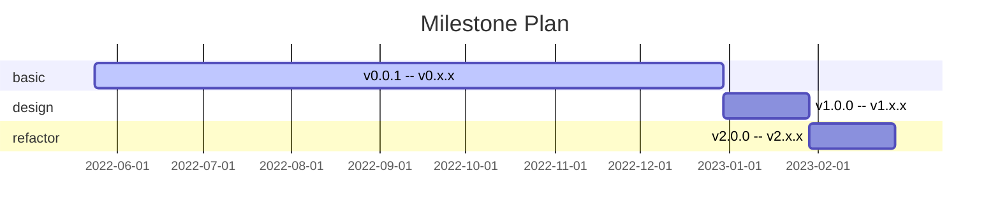
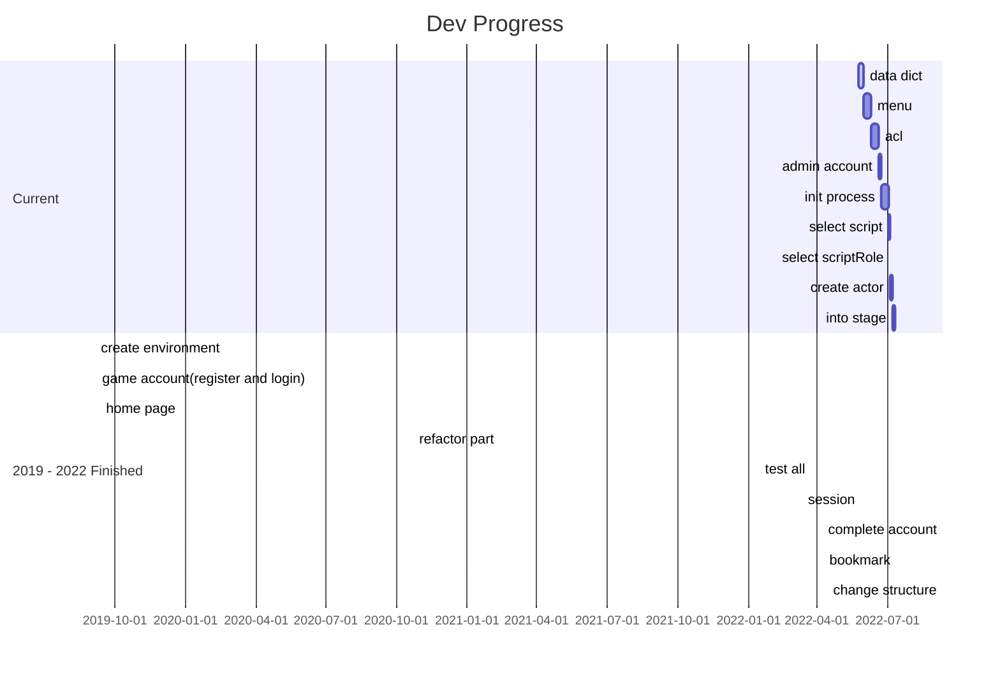

计划文档
======

计划文档包含 **版本计划** 和 **开发进度** 两大类。

---

## 版本计划

主要版本的开发计划。

| 版本编号                 | 关键功能                             | 时间节点               |
|----------------------|----------------------------------|--------------------|
| `v0.0.1` -- `v0.x.x` | 基础功能，具体参考开发文档                    | 预计 2022 年内完成       |
| `v1.0.0` -- `v1.x.x` | 内容设计，具体参考开发文档                    | 等待基础功能完成           |
| `v2.0.0` -- `v2.x.x` | 架构重构：前后端分离 `Angular` or `Vue` | 等待 `v1.x.x` 版本发布之后 |

## 开发进度

主要展示当前进度，并以倒序方式陈列已完成的进度总结。

### 当前进度

- [ ] 数据字典设计
- [ ] 菜单设计
- [ ] 权限设计
- [ ] 管理员账号
- [ ] 初始化流程
- [ ] 选择剧本、选择角色、创建演员、进入舞台

### 2019-2022 年已完成

- [x] 创建环境
- [x] 游戏账号：注册、登录
- [x] 模仿地狱之门首页：背景图轮播
- [x] 重构部分
- [x] 测试整体
- [x] 完善会话——需要观察
- [x] 完善账号：身份证绑定、uid 登录
- [x] 书签功能
- [x] 调整结构